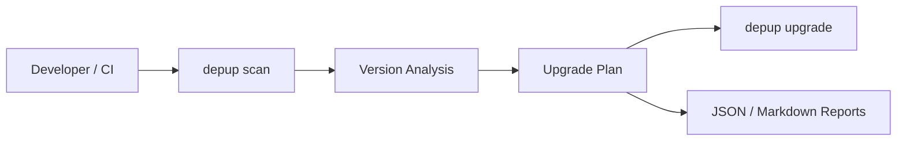
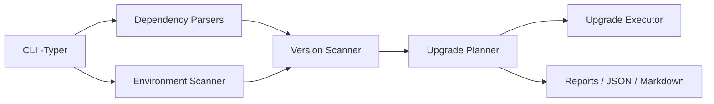

# depup — Dependency Upgrade Advisor

[](https://pypi.org/project/depup/)


[](https://github.com/saran-damm/depup/actions)
[](https://saran-damm.github.io/depup/)

**depup** is a production-grade Python CLI that helps developers **understand, audit, and safely upgrade dependencies** across projects and environments.

It focuses on:
- correctness
- visibility
- CI-friendliness
- minimal surprises

---


## Why Depup?

Managing Python dependencies looks simple—until it isn’t.

Most teams eventually face at least one of these problems:

* Dependencies silently drift out of date
* Upgrading one package breaks others
* CI pipelines fail due to incompatible versions
* Security fixes are delayed because upgrades feel risky
* Different projects use different dependency formats
* There’s no clear visibility into *what* will change before upgrading

Depup exists to **make dependency upgrades safe, visible, and intentional**.

---

### The Problem with Existing Tools

| Tool                        | Limitation                             |
| --------------------------- | -------------------------------------- |
| `pip list --outdated`       | No semantic context, no safety         |
| `pip-tools / poetry update` | Updates blindly, often breaking things |
| Dependabot                  | Reactive, PR-heavy, noisy              |
| Manual upgrades             | Time-consuming, error-prone            |

Most tools answer **“what is outdated?”**
Depup answers **“what should I upgrade, why, and how risky is it?”**

---

### What Depup Does Differently?

Depup is designed as a **dependency intelligence layer**, not just an updater.

#### Deep Visibility Before Change

* See **declared vs latest versions**
* Understand **semantic impact** (patch / minor / major)
* Works across:

  * `requirements.txt`
  * `pyproject.toml` (PEP 621 + Poetry)
  * `Pipfile`
  * `Poetry.lock`, `Pipfile.lock`
  * Installed environments (`--env`)

#### Safety-First Upgrades

* Dry-run support (`--dry-run`)
* Selective upgrades (`--only-patch`, `--only-minor`, `--only-major`)
* Package-level filtering
* No blind rewriting of dependency files

#### CI & Automation Ready

* `--check` mode with proper exit codes
* JSON output for pipelines
* Markdown reports for audits and reviews
* Designed for GitHub Actions, GitLab CI, Azure DevOps

#### Built for AI-Native Workflows

Depup is architected to integrate with:

* AI IDE agents (Cursor, Windsurf, Continue)
* MCP-based tooling
* Future AI-driven upgrade analysis and code fixes

This makes depup **future-proof**, not just useful today.

---

### Where Depup Fits in Your Workflow



Depup fits **before** upgrades — exactly where most failures happen.

---

### Who depup is for?

* **Individual developers** who want safer upgrades
* **Teams** managing multiple Python projects
* **CI/CD pipelines** that need deterministic dependency checks
* **Open-source maintainers** avoiding breaking releases
* **AI-assisted workflows** needing structured dependency data


---

## Features

### Implemented (v0.9.0)
- Scan dependency files:
  - `requirements.txt`
  - `pyproject.toml` (PEP 621 + Poetry)
  - `Pipfile`
  - `Poetry.lock` (read-only)
  - `Pipfile.lock` (read-only)
- Scan installed environments (`--env`)
- Fetch latest versions from PyPI
- Semantic update classification:
  - patch / minor / major / none
- JSON output (`--json`)
- Markdown reports (`--report`)
- CI-friendly check mode (`--check`)
- Deterministic upgrade planning
- Safe upgrade execution (`depup upgrade`)

### Planned (towards v1.0.0)
- Smarter conflict detection
- Editable upgrade policies
- AI-assisted changelog summaries
- IDE / MCP agent integration

---

## Installation

```bash
pip install depup
```

or with `uv`:

```bash
uv tool install depup
```

---

## Usage

### Scan project dependencies

```bash
depup scan
```

### Include latest versions from PyPI

```bash
depup scan --latest
```

### Fail CI if outdated dependencies exist

```bash
depup scan --latest --check
```

### Scan installed environment

```bash
depup scan --env --latest
```

### Generate JSON output

```bash
depup scan --latest --json
```

### Generate Markdown report

```bash
depup scan --latest --report deps.md
```

---

## Upgrading dependencies

Preview upgrades (safe):

```bash
depup upgrade --dry-run
```

Apply upgrades:

```bash
depup upgrade
```

Upgrade only patch updates:

```bash
depup upgrade --only-patch
```

Upgrade environment packages:

```bash
depup upgrade --env
```

---

## Architecture



---

## Testing

```bash
pytest -q
```

All critical components are unit tested.

---

## Versioning Philosophy

* `0.x` → Rapid iteration, APIs may evolve
* `0.9.x` → Feature-complete, stable, CI-ready
* `1.0.0` → API freeze, backward compatibility guarantees

---

## License

MIT License — see `LICENSE`.

---

## Contributing

Issues, PRs, and discussions are welcome.
Please keep changes small and well-tested.

---

## Acknowledgements

Built with:

* Typer
* Rich
* packaging
* requests

Inspired by real-world CI and dependency pain.

---

## Detailed documentation available at:
https://saran-damm.github.io/depup/