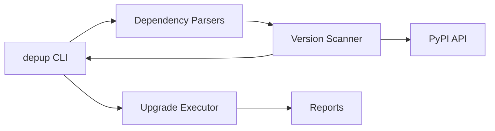

# Architecture Overview

depup is designed as a modular, extensible CLI tool.

---

## High-level architecture

---

## Core components

### CLI Layer

* Typer-based interface
* Handles flags, output, and exit codes

### Parsers

* Parse dependency declarations and lockfiles
* Normalize dependencies into a common model

### Version Scanner

* Queries PyPI
* Compares versions
* Classifies update impact

### Upgrade Executor

* Applies upgrades safely
* Updates dependency files

### Reporting

* JSON output
* Markdown reports
* CI-friendly results